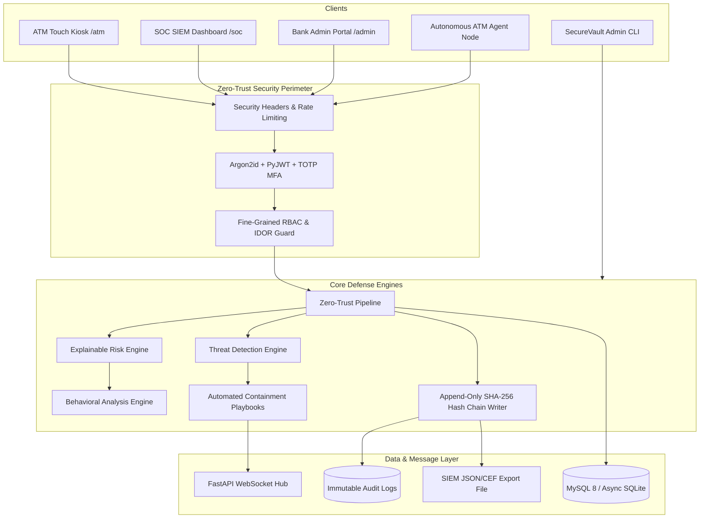
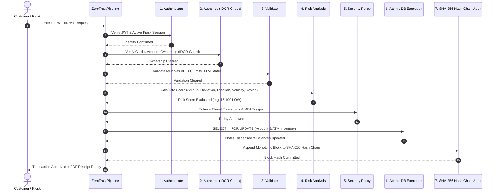
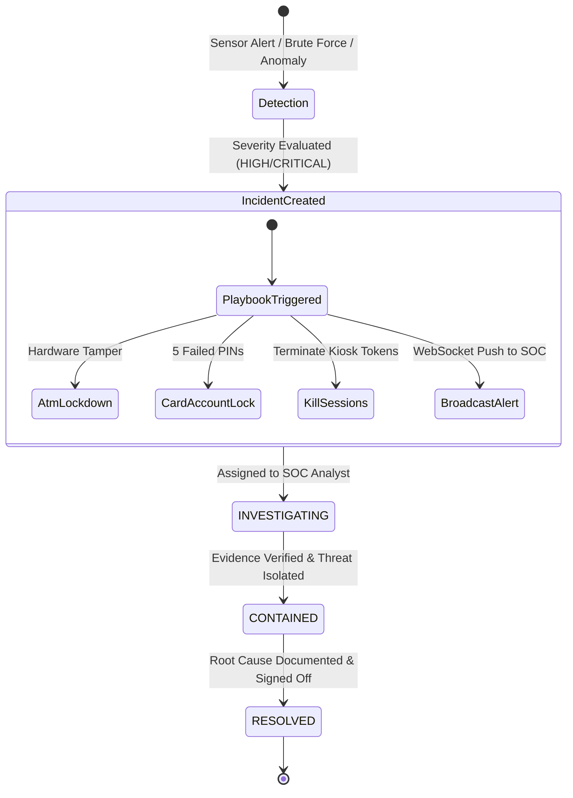

# SecureVault ATM - System Architecture Specification

## 1. High-Level System Architecture

---

## 2. Zero-Trust Transaction Execution Pipeline

---

## 3. Incident Response & Threat Containment Lifecycle

---

## 4. Tamper-Evident SHA-256 Hash Chain Structure

```mermaid
graph LR
    subgraph Genesis_Block
        G_Prev["prev_hash: 000...000"]
        G_Seq["seq_no: 1"]
        G_Payload["payload: SYSTEM_INIT"]
        G_Hash["hash: SHA256(...)"]
    end

    subgraph Block_N
        B_Prev["prev_hash = Hash(Block 1)"]
        B_Seq["seq_no: 2"]
        B_Payload["payload: ATM_CASH_WITHDRAWAL"]
        B_Hash["hash: SHA256(prev_hash || seq || payload)"]
    end

    subgraph Block_N_Plus_1
        C_Prev["prev_hash = Hash(Block 2)"]
        C_Seq["seq_no: 3"]
        C_Payload["payload: BRUTE_FORCE_LOCKOUT"]
        C_Hash["hash: SHA256(prev_hash || seq || payload)"]
    end

    Genesis_Block --> Block_N --> Block_N_Plus_1
```

